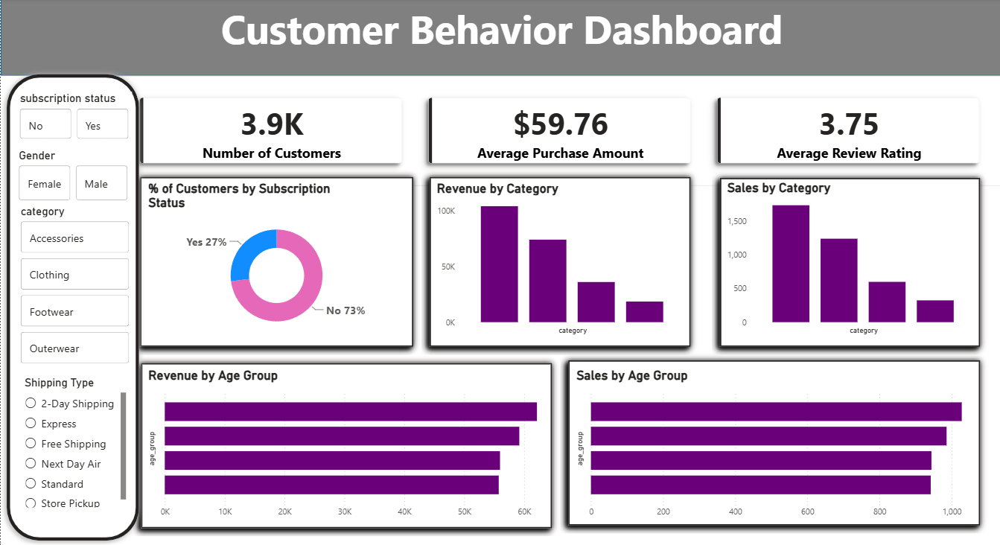

# Customer Shopping Behavior Analysis

## Project Overview
Analyzed customer shopping behavior using 
transactional data from 3,900 customers across 
various product categories.

## Tools Used
- Python (Pandas, Matplotlib) — EDA & Cleaning
- SQL (PostgreSQL) — Business Analysis
- Power BI — Interactive Dashboard
- Excel — Data Exploration

## Key Insights
- Male customers generate 2x more revenue ($157,890) than female ($75,191)
- 73% customers are non-subscribers — big opportunity to grow subscriptions
- Young Adults are the highest revenue age group ($62,143)
- Clothing is the top selling category
- Gloves is the highest rated product (3.86 avg rating)

## Files
- .ipynb → Python EDA Notebook
- .sql → SQL Queries
- .pbix → Power BI Dashboard
- .png → Dashboard Screenshot
- .pdf → Project Report
- .pptx → Presentation
- .csv → Raw Dataset

## Dashboard Preview

